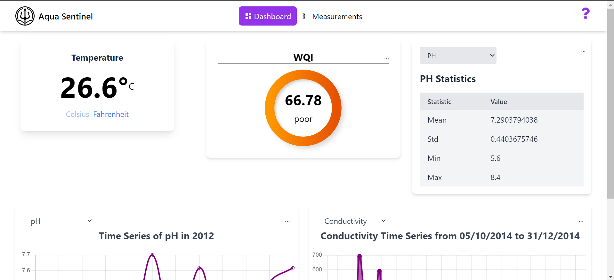

# Aqua Sentinel: Real-Time Water Quality Monitoring System

## Project Description

This project focuses on enhancing water quality monitoring using machine learning algorithms to ensure the safety and availability of water resources for current and future generations. Effective monitoring allows for the early detection of water degradation, enabling prompt interventions to protect public health and the environment.
By leveraging advanced ML technologies, Aqua Sentinel aims to improve the accuracy, efficiency, and sustainability of water quality monitoring systems.

## Objectives

- **Develop a robust and efficient methodology for real-time monitoring of water quality utilizing machine learning algorithms.**
- **Implement a machine learning-based approach for predicting real-time water quality index (WQI) values using a set of measured parameters.**
- **Provide a suite of tools designed to visualize water physiochemical parameters over time in a clear and user-friendly manner.**
- **Develop a comprehensive platform that enables users to access and track the history of measurements and predictions over time.**

## Materials and Methodology

### Proposed Methodology

1. **Data Exploration and Preprocessing:**
   - Convert all data types into numerical formats.
   - Replace missing numerical values using median imputation.
   - Remove outliers using the Z-score method.
   - Drop measurements resulting in a negative WQI.

2. **Machine Learning Models:**
   - Train and evaluate four regression models: K-Nearest Neighbors (KNN), Decision Tree (DT), Support Vector Regression (SVR), and Multi-Layer Perceptron (MLP). and choose the most suitable one (all explained in the notebook)
   - Use cross-validation techniques to assess model performance.

### Dataset

The dataset used in this study comprises data collected from lakes and rivers across various locations in India from 2005 to 2014. It includes 1991 instances and 7 distinct features: Dissolved Oxygen, pH, Conductivity, Biological Oxygen Demand (BOD), Nitrate, Fecal Coliform, and Total Coliform.

Dataset Link : https://www.kaggle.com/datasets/anbarivan/indian-water-quality-data


## Usage
1. **Clone the Repository:**
   ```sh
   git clone https://github.com/YASSINEKS007/Water-Quality-Monitoring-Project.git

2. Navigate to the project:
    ```sh
    cd Water-Quality-Monitoring-Project

### Backend
1. Navigate to the backend folder:
   ```sh 
      cd backend

2. install the dependencies :
     ```sh
       pip install -r requirements.txt

3. Run the Flask server:
     ```sh
     python app.py

### Frontend
1. Navigate to the frontend folder:
   ```sh
   cd frontend

2. Install dependencies:
   ```sh
   npm install

3. Run the frontend server:
   ```sh
   npm run dev        

## Screenshots

### Dashboard Page:


            
### Measurements Page:
 


